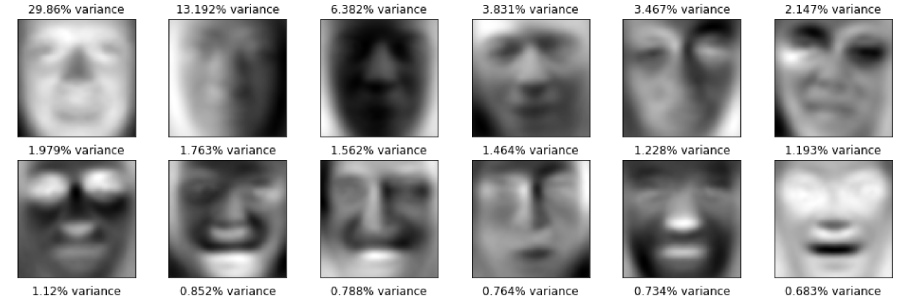

# Eigenfaces

## About

This project is the term project for CSU's MATH 469: Linear Algebra II.  It is an implementation of Eigenfaces, which is a method of data reduction / facial recognition that uses eigendecomposition to store face images as a linear combination of some optimal "eigenfaces."

## Introduction (Abstract)
Eigenface decomposition is the application of Principal Component Analysis (PCA) on images that contain faces in them. This decomposition allows implementers to achieve data reduction in images by calculating the vectors in high dimensional space that represent the largest variation in images. These vectors are called eigenfaces, and are the principal components of a dataset of face images. The corresponding eigenvalues represent the variance in image data each eigenface explains. Applying this to data reduction, we observe a 2.618 : 1 data reduction, but also that modern data reduction techniques are more efficient. Furthermore, we observe that by keeping the first 1589 eigenvectors in ${\rm I\!R}^{4096}$, we can retain 99.9% of variation in images. Finally, a discussion of this technique applied to facial recognition and machine learning is presented.

## Note
When viewing Eigenfaces.ipynb, 

## Contact

To ask me about the project, email preston.dunton@gmail.com.
